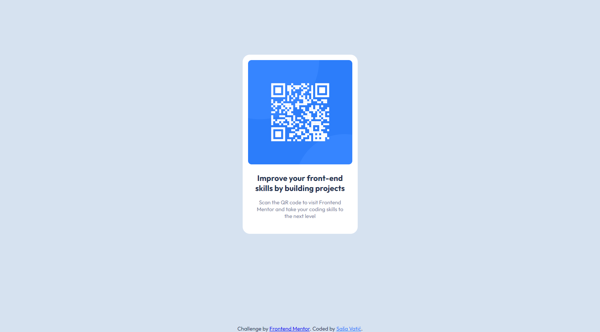

# Frontend Mentor - QR code component solution

This is a solution to the [QR code component challenge on Frontend Mentor](https://www.frontendmentor.io/challenges/qr-code-component-iux_sIO_H). Frontend Mentor challenges help you improve your coding skills by building realistic projects. 

## Table of contents

- [Overview](#overview)
  - [Screenshot](#screenshot)
  - [Links](#links)
- [Built with](#built-with)
- [Author](#author)

## Overview

### Screenshot

### Links

- Solution URL: [https://www.frontendmentor.io/solutions/html-css-tbpa79tsDt](https://www.frontendmentor.io/solutions/html-css-tbpa79tsDt)
- Live Site URL: [https://sasavatic.github.io/qr-code-component/](https://sasavatic.github.io/qr-code-component/)

### Built with

- Semantic HTML5 markup
- CSS
- Mobile-first workflow

## Author

- Website - [Saša Vatić](https://sasavatic.netlify.app/)
- Frontend Mentor - [@SasaVatic](https://www.frontendmentor.io/profile/SasaVatic)
- Twitter - [@SaaV59345676](https://twitter.com/SaaV59345676)
